<picture>
  <source media="(max-width: 600px)" srcset="assets/hero-mobile.svg">
  
</picture>

## About Me

- Computer Engineering student at the **University of Waterloo**.
- Software Engineer Intern at **YGBK International Education Technology**.
- Based in **Waterloo / Toronto, Ontario**.
- My work spans web and mobile interfaces, backend services, and production operations.

[GitHub](https://github.com/tianzeyin) · [LinkedIn](https://www.linkedin.com/in/tianze-yin) · [Email](mailto:yintz1207@gmail.com)
